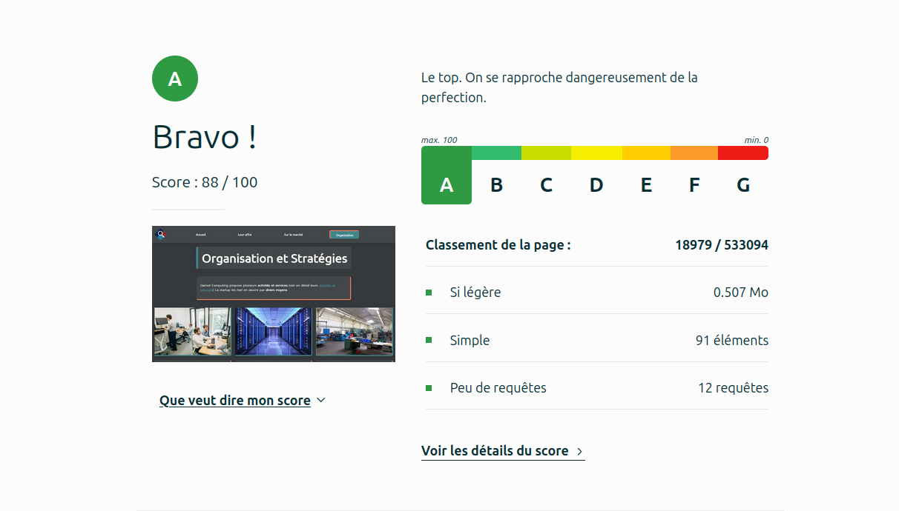

# Site Web Qarnot   

## Présentation d'une entreprise ESN    

[SiteWebQarnot](https://plamour.github.io/SiteWebQarnot/)

## Membres du groupe :

Etudiant 1 (référent du groupe) :  [LAMOUR](mailto:pierre.lamour@edu.umlp.fr?subject=SAE_1_05_06)  
Etudiant 2 : [LAURENÇOT](mailto:noe.laurencot@edu.umlp.fr?subject=SAE_1_05_06)   
Etudiant 3 : [JEANROT](mailto:jules.jeanrot@edu.umlp.fr?subject=SAE_1_05_06)  

## Présentation du projet

Ce projet SAÉ S1 05-06, a pour but de presenter l'entreprise qarnot computing
Nous decrivons l'activité économique et les activités de l'entreprise de multiples manières sur un wite web informatif.

## Développement Site Web et Validation des pages

### Page d'accueil

** Auteur: : LAMOUR Pierre **

Vérification W3C : (https://validator.w3.org/nu/?doc=https%3A%2F%2Fplamour.github.io%2FSiteWebQarnot%2F)

### Page 1 - Les offres

** Auteur: : LAURENCOT Noé **

Vérification W3C : (https://validator.w3.org/nu/?doc=https%3A%2F%2Fplamour.github.io%2FSiteWebQarnot%2Fpage1.html)

### Page 2 - Le marché

** Auteurs: : LAURENCOT Noé et JEANROT Jules **

Vérification W3C : (https://validator.w3.org/nu/?doc=https%3A%2F%2Fplamour.github.io%2FSiteWebQarnot%2Fpage2.html)

### Page 3 - L'organisation

** Auteur: : JEANROT Jules **

Vérification W3C : (https://validator.w3.org/nu/?doc=https%3A%2F%2Fplamour.github.io%2FSiteWebQarnot%2Fpage3.html)

## Répartition du travail

### Planification - Diagramme de GANTT

- LAMOUR Pierre

### Recherches d'informations

- Laurençot Noé

### Développement site

- LAMOUR Pierre
  - Page d'accueil
- LAURENCOT Noé
  - Page 1 - offre
  - Page 2 - marché
  - Majorité du css
- JEANROT Jules
  - Page 2 - marché
  - Page 3 - organisation

## Contributeurs

## info-contributeur
 BlueberrySudo est le double compte de noe.laurencot. Il s'est retrouvé par erreur dans le commit.

